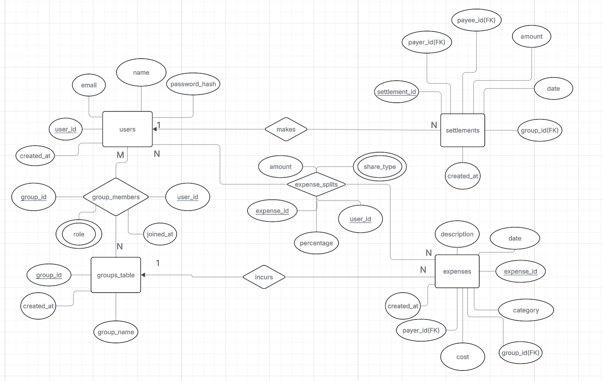

# BudgetWise Project for CS-480

BudgetWise is a database-driven group expense management system that helps users track shared spending, split costs fairly, and settle balances within groups such as friends, roommates, or event participants. Users can create or join groups, record expenses, automatically divide costs among members, view who owes whom, and keep a transparent history of settlements and activity. By structuring all financial interactions using a relational database, BudgetWise aims to provide reliability, fairness, and transparency in managing shared expenses. :contentReference[oaicite:0]{index=0}

---

## 📚 Table of Contents

- [Features](#-features)
- [Tech Stack](#-tech-stack)
- [Getting Started](#-getting-started)
  - [Prerequisites](#prerequisites)
  - [Setup](#setup)
- [Contributing](#-contributing)

---

## ✨ Features

BudgetWise supports the following core features: :contentReference[oaicite:1]{index=1}

- **User Registration and Login**  
  Users can create an account using their name, email, and password, then securely log in to access their groups, expenses, and settlements.

- **Group Creation and Management**  
  Create groups for trips, households, events, or any shared context. Add members and manage group information.

- **Recording Shared Expenses**  
  Add expenses with amount, category, date, payer, and associated group. Expenses are stored with full detail for later analysis.

- **Splitting Expenses Among Members**  
  Split expenses equally or by percentage among group members. The system calculates each member’s share automatically, reducing manual math.

- **Tracking Balances (“Who Owes Whom”)**  
  View a breakdown of balances per group, including how much each user owes and is owed.

- **Making Settlements**  
  Record settlement payments between members (payer → payee) to clear outstanding balances, keeping the ledger up-to-date.

- **Group Activity History**  
  View a history of expense additions, splits, and settlements to understand the flow of money over time.

- **Secure Profile Management**  
  Users can update their profile details (name, email, password) while keeping financial data private.

- **Spending Insights (Basic)**  
  Track spending across categories and monthly expenditure at the group level. :contentReference[oaicite:2]{index=2}

---

## 🛠 Tech Stack

BudgetWise is built using a classic full-stack JavaScript setup: :contentReference[oaicite:3]{index=3}

- **Frontend:** React.js
- **Backend Runtime:** Node.js
- **Backend Framework:** Express.js
- **Database:** MySQL (relational database for all application data)

---

## 🗂 Database ER Diagram

